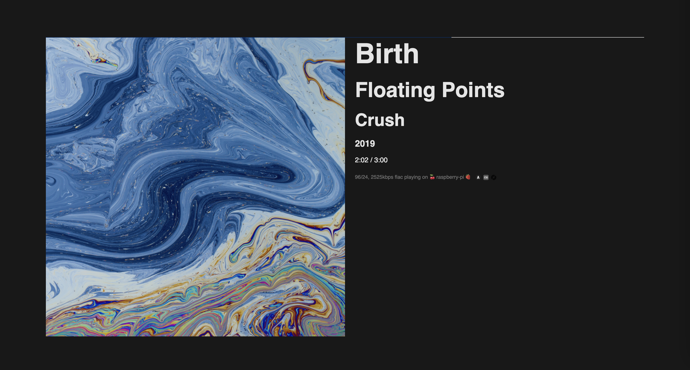

# Plex Now Playing Viewer

This provides a simple client-side application to display "Now Playing" information from your Plex Media Server. It uses the Plex API to fetch the current playing track details and updates the UI dynamically.

## Features

- Fetches and displays the currently playing track information.
- Shows track metadata such as artist, album, title, and duration.
- Displays album art with a dominant color-based progress bar.
- Provides external links to artist information on Album of the Year, Last.fm, and Discogs.
- Real-time progress tracking for the currently playing track.


## Prerequisites

- A Plex Media Server.
- An API key for your Plex server.
- Basic knowledge of setting up a local development environment.

## Setup
1. **Clone the repository**:
   To clone this repository to your local machine, run the following command:

   ```bash
   git clone https://github.com/peterdconradie/plexdash.git
   ```

2. **Copy the files**:
   Copy the entire `plexdash` folder to wherever you prefer to run it from. Make sure you retain the folder structure.

3. **Add your Plex API key and server URL**:
   Rename the file `apikey_CHANGE_THIS.js` to `apikey.js` in the project directory. Then, update the file with your Plex API key and server URL by replacing the placeholder values:

   ```javascript
   export const plexApiKey = 'YOUR_PLEX_API_KEY'; // Find it here: https://support.plex.tv/articles/204059436-finding-an-authentication-token-x-plex-token/
   export const plexServerUrl = 'YOUR_PLEX_SERVER_URL';
   ```

4. **Open the project in a browser**:
   To view the project, you'll need to run it on a local web server. If you're on a Mac, navigate to the project directory in the terminal and run:

   ```bash
   python3 -m http.server
   ```

   This will start a local web server on port `8000`. Open your browser and go to `http://localhost:8000` to view the project.

## What does it look like?



## Troubleshooting

- Ensure the API key and server URL in `apikey.js` are correct.
- Use browser developer tools to debug any issues (check console logs for errors).
- If cross-origin issues occur, ensure the Plex server allows connections from your browser.

## Issues
- The progress bar can be janky, plex doesn't reliably provide the information and it won't worked when paused. Refreshing should bring you to more or less the right place. 


## License

This project is open-source and licensed under the [MIT License](LICENSE).

## License
This project was inspired by [PlexampStatusPage](https://github.com/claesbert/PlexampStatusPage)


